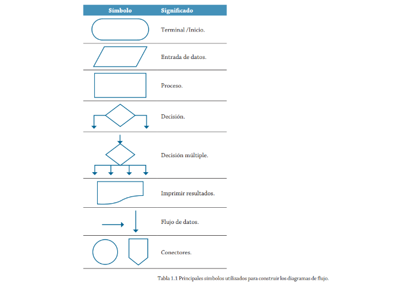
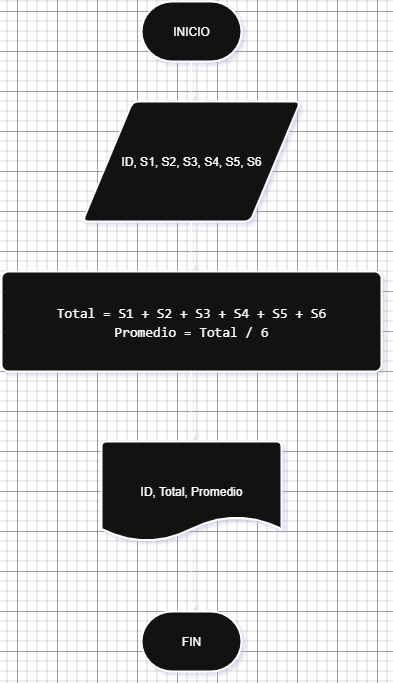

# ALGORITMOS ACTIVIDAD 2

## 1. Pseudocódigo: 
Es una representación en lenguaje natural de los pasos que conforman un algoritmo. Se utiliza para describir de manera estructurada y comprensible las acciones necesarias para resolver un problema antes de implementarlo en un lenguaje de programación.

Ejemplo: Cálcular area de un triángulo

Inicio
Leer base, altura
Calcular área = (base * altura) / 2
Mostrar área
Fin

Variables de entrada: Base y Altura, pueden ser enteros o de punto flotante (generalmente en minúsculas y sin espacios)
Salida: Área 

Nota: Leer es solicitarle al usuario externo que ingrese un dato.

# Ejercicio 1.
Investiga cuáles son los símbolos que se utilizan para representar cada operación de un algorimo con un diagrama de flujo. Asegúrate de que la fuente es confiable, discute lo que encontraste con tus compañeros y con el profe. Cuando estés seguro/a de tener los símbolos correctos, consigna la información en la bitácora.

## Solución:



# Ejercicio 2
Construye un algoritmo que, al recibir como datos el ID del empleado y los seis primeros sueldos del año, calcule el ingreso total semestral y el promedio mensual, e imprima el ID del empleado, el ingreso total y el promedio mensual.

## Solución:

## Pseudocódigo
``` 
Inicio
Leer ID, S1, S2, S3, S4, S5, S6
Total = S1 + S2 + S3 + S4 + S5 + S6
Promedio = Total / 6
Escribir ID, Total, Promedio
Fin
```
## Diagrama de Flujo


# TAREA:
Para la próxima clase traer el pseudocode y el diagrama de flujo de:
Curso se evalua con 7 notas, conoce 6 notas que equivalen al 70%, calcular cuanto debo sacar en la evualuacion final para aprobar con 3.0
Primero hacer el analisis, segundo el pseudocode y por ultimo el diagrama final en este marckdown.