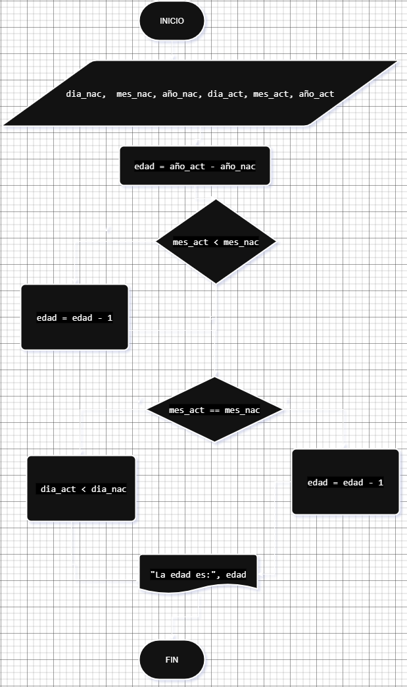

# ALGORITMOS ACTIVIDAD 2

## 1. Pseudocódigo: 
Es una representación en lenguaje natural de los pasos que conforman un algoritmo. Se utiliza para describir de manera estructurada y comprensible las acciones necesarias para resolver un problema antes de implementarlo en un lenguaje de programación.

Ejemplo: Cálcular area de un triángulo

Inicio
Leer base, altura
Calcular área = (base * altura) / 2
Mostrar área
Fin

Variables de entrada: Base y Altura, pueden ser enteros o de punto flotante (generalmente en minúsculas y sin espacios)
Salida: Área 

Nota: Leer es solicitarle al usuario externo que ingrese un dato.

# Ejercicio 1.
Investiga cuáles son los símbolos que se utilizan para representar cada operación de un algorimo con un diagrama de flujo. Asegúrate de que la fuente es confiable, discute lo que encontraste con tus compañeros y con el profe. Cuando estés seguro/a de tener los símbolos correctos, consigna la información en la bitácora.

## Solución:


# Ejercicio 2
Construye un algoritmo que, al recibir como datos el ID del empleado y los seis primeros sueldos del año, calcule el ingreso total semestral y el promedio mensual, e imprima el ID del empleado, el ingreso total y el promedio mensual.

## Solución:

## Pseudocódigo
``` 
Inicio
Leer ID, S1, S2, S3, S4, S5, S6
Total = S1 + S2 + S3 + S4 + S5 + S6
Promedio = Total / 6
Escribir ID, Total, Promedio
Fin
```
## Diagrama de Flujo


# TAREA:
Para la próxima clase traer el pseudocode y el diagrama de flujo de:
Curso se evalua con 7 notas, conoce 6 notas que equivalen al 70%, calcular cuanto debo sacar en la evualuacion final para aprobar con 3.0
Primero hacer el analisis, segundo el pseudocode y por ultimo el diagrama final en este marckdown.

## Solución:

## 1. Pseudocódigo
```
Inicio
Leer n1, n2, n3, n4, n5, n6
Promedio = (n1 + n2 + n3 + n4 + n5 + n6) / 6
nota_necesaria = (3.0 - (promedio * 0.7)) / 0.3
Escribir "Debes sacar", nota_necesaria, "en la nota 7 para aprobar con 3.0"
Fin
```

## 2. Diagrama de flujo


## Ejercicios:

1. Realice un algoritmo para determinar cuánto se debe pagar por equis cantidad de lápices considerando que si son 1000 o más el costo es de $85 cada uno; de lo contrario, el precio es de $90. Represéntelo con el pseudocódigo y el diagrama de flujo.

|Variables| Tipo|Comentario|
|---------|-----|---------|
|Lapices  | Entrada|Cantidad de lapices|
|valor_unidad | Intermedia|Valor unitario de cada lapiz|
|precio  | Salida|Precio Total de los lapices|
|85, 90  | Constantes|No cambian|

## Pseudocódigo

```
Inicio
Leer Lapices
Si lapices >= 1000: 
    valor_unidad = 85 
Si no
    valor unidad = 90
Fin Si
Precio = Lapices * valor_unidad
Escribir "El valor total es:", Precio
Fin
```
## Diagrama de Flujo: 


2. Un almacén de ropa tiene una promoción: por compras superiores a $250 000 se les aplicará un descuento de 15%, de caso contrario, sólo se aplicará un 8% de descuento. Realice un algoritmo para determinar el precio final que debe pagar una persona por comprar en dicho almacén y de cuánto es el descuento que obtendrá. Represéntelo mediante el pseudocódigo y el diagrama de flujo.

|Variables| Tipo|Comentario|
|---------|-----|---------|
|total_compra | Entrada|Valor de la compra|
|descuento | Salida|Descuento segun el valor de la compra|
|precio_final| Salida|Valor a pagar|
|15%, 8%, $250000  | Constantes|Descuentos y Valor limite|

## Pseudocodigo:
```
Inicio
Leer total_compra
Si total_compra > 250000:
    descuento = total_compra * 0,15
Si no
    descuento = total_compra * 0,08
Fin Si 
precio_final= total_compra - descuento
Escribir "Valor a pagar", precio_final
Fin
```
## Diagrama de Flujo:


3. El director de una escuela está organizando un viaje de estudios, y requiere determinar cuánto debe cobrar a cada alumno y cuánto debe pagar a la compañía de viajes por el servicio. La forma de cobrar es la siguiente: si son 100 alumnos o más, el costo por cada alumno es de $65.00; de 50 a 99 alumnos, el costo es de $70.00, de 30 a 49, de $95.00, y si son menos de 30, el costo de la renta del autobús es de $4000.00, sin importar el número de alumnos.

|Variables| Tipo|Comentario|
|---------|-----|---------|
|alumnos | Entrada|Alumnos|
|costo_alumno | Salida|Valor por alumno|
|costo_total| Salida|Valor a pagar en total|
|100, 50-49, 30-49  | Constantes|Numero de alumnos|

```
Inicio
leer alumnos
si alumnos >=100
    costo_a lumno= $65
si no 
    si alumnos >=50
        costo_alumno= $70
    si no alumnos >=30
        costo_alumno= $95
    si no
        costo_total=$4000
        costo_alumno=costo_total / alumnos
    fin si

si alumnos>=30
    costo_total= costo_alumno*alumnos
fin si

escribir "el costo por alumno es:", costo_alumno
escribir "el costo total es:", costo_total
Fin
```
## Diagrama de Flujo:


# TAREA:
dia                                       dia_actual
mes                                       mes_actual
año                                       año_actual
Pedirle al usuario que ingrese el dia mes y año de nacimiento y por otro lado dia mes y año actual, con estos valores calcular la edad. 

## SOLUCIÓN:

| Variables     | Tipo      | Comentario                               |
|---------------|-----------|------------------------------------------|
| dia_nac       | Entrada   | Día de nacimiento                        |
| mes_nac       | Entrada   | Mes de nacimiento                        |
| año_nac       | Entrada   | Año de nacimiento                        |
| dia_act       | Entrada   | Día actual                               |
| mes_act       | Entrada   | Mes actual                               |
| año_act       | Entrada   | Año actual                               |
| edad          | Salida    | Edad calculada                           |
| (mes, día)    | Constante | Se usa para comparar fechas              |

## Pseudocódigo:


```
Inicio

leer dia_nac
leer mes_nac
leer año_nac

leer dia_act
leer mes_act
leer año_act

edad = año_act - año_nac

si mes_act < mes_nac
    edad = edad - 1
si no
    si mes_act == mes_nac
        si dia_act < dia_nac
            edad = edad - 1
fin si

escribir "La edad es:", edad

Fin
```

## Diagrama de Flujo:


