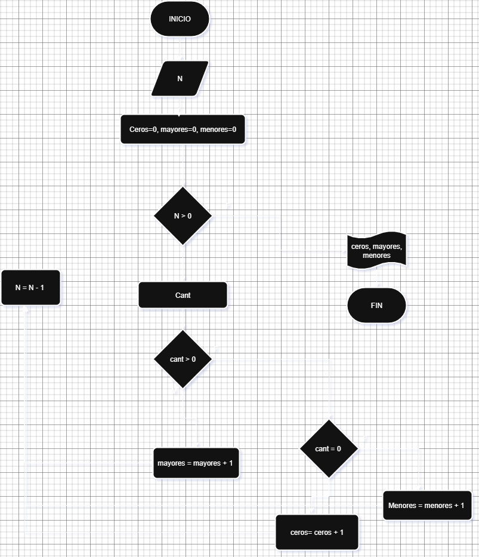
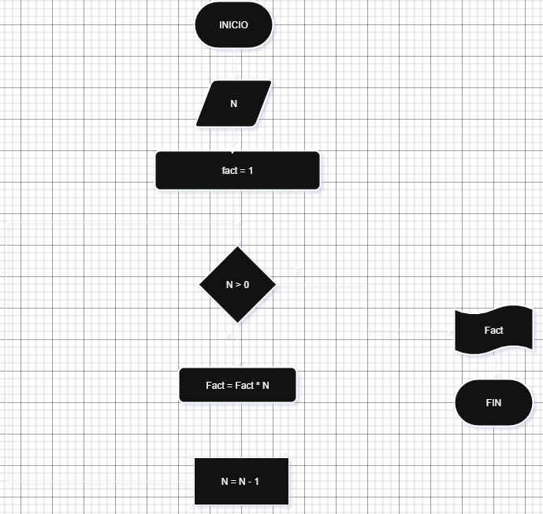
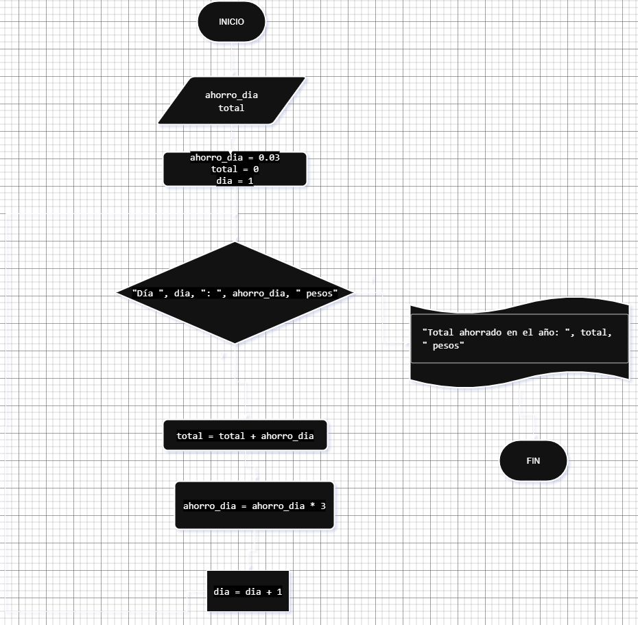
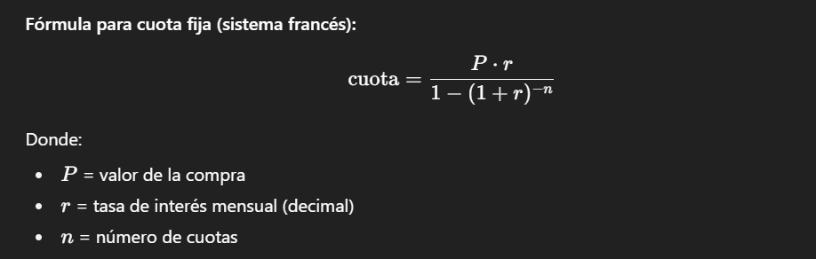
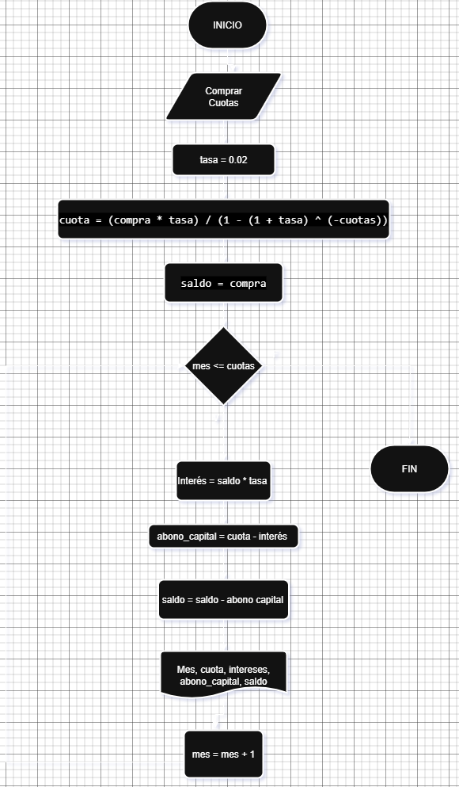

# Bucles o Ciclos

Un bucle en programación es una estructura de control que permite ejecutar repetidamente un bloque de código mientras se cumple una condición específica o durante un número determinado de iteraciones. Son fundamentales para automatizar tareas repetitivas, realizar cálculos iterativos y procesar grandes conjuntos de datos. En el lenguaje C, existen tres tipos principales de bucles: **for**, **while**, y **do-while**. El bucle **for** se utiliza cuando se conoce de antemano la cantidad de iteraciones, especificando un inicio, una condición y un incremento o decremento. El bucle **while** ejecuta el bloque de código mientras la condición sea verdadera, siendo útil cuando no se conoce el número exacto de iteraciones. Finalmente, el bucle **do-while** es similar al **while**, pero garantiza que el bloque de código se ejecute al menos una vez, ya que evalúa la condición al final de cada iteración. Estas estructuras son herramientas esenciales para la resolución eficiente de problemas en C.

# Ejercicios de Bucles en Clase:
## Ejercicio 1.
 Se requiere un algoritmo para determinar, de N cantidades, cuantas son cero, cuantas son menores a cero y cuantas son mayores a cero. Realice el diagrama de flujo y el pseudocodigo, representarlo, utilizando el ciclo apropiado

|Input | Cantidad|Control|
|---------|-----|---------|
|N, cant| ceros, mayores, menores (contador)| N|

```
Inicio
Leer N
ceros = 0
mayores = 0
menores = 0
Mientras N > 0:
    Leer cant
    Si cant > 0:
        mayores = mayores+1
    Si no
        Si cant = 0:
        ceros = ceros + 1
    Si no
        menores = menores + 1
    Fin si
Fin si
N = N - 1
Fin Mientras
Mostrar ceros, mayores, menores
Fin
```


## Ejercicio 2.
 Calcular el Factorial de un numero entero ingresado por el usuario.
 

# TAREA:
Del libro de algoritmos:
Ejercicios: 4.5
Se requiere un algoritmo para determinar cuánto ahorrará en pesos una persona diariamente, y en un año, si ahorra 3¢ el primero de enero, 9¢ el dos de enero, 27¢ el 3 de enero y así sucesivamente todo el año. Represente la solución mediante el diagrama de flujo, el pseudocódigo y el diagrama N/S, utilizando el ciclo apropiado.

Ejercicio 2.
Consultar cómo funcionan las tarjetas de crédito. Asumir una tasa de interés fija (2%). Preguntar al usuario el valor de la compra y el número de cuotas. Calcular y mostrar en pantalla. El valor de cada una de las cuotas que debe pagar hasta saldar la deuda.

## Solución ejercicio 4.5:

## Pseudocodigo:
```
Inicio
Leer ahorro_dia = 0.03
total = 0
dia = 1

Mientras dia ≤ 365 Hacer
    Escribir "Día ", dia, ": ", ahorro_dia, " pesos"
    total = total + ahorro_dia
        ahorro_dia = ahorro_dia * 3
        dia = dia + 1
Fin Mientras

Escribir "Total ahorrado en el año: ", total, " pesos"
Fin
```
## Diagrama de Flujo:


## Solución ejercicio 2:

De mi consulta pude extraer la siguiente fórmula para cuota fija (sistema francés):



Teniendo esta informacion en cuenta se podria crear el pseudocodigo

## Pseudocodigo:

```
Inicio
Leer compra
Leer cuotas

 tasa = 0.02
cuota = (compra * tasa) / (1 - (1 + tasa) ^ (-cuotas))
saldo = compra

    Mientras mes <= cuotas
        interes = saldo * tasa
        abono_capital = cuota - interes
        saldo = saldo - abono_capital
        Escribir "Mes ", mes, ": cuota=", cuota, " interés=", interes, " capital=", abono_capital, " saldo=", saldo
    Fin Mientras
Fin
```
## Diagrama de Flujo:

